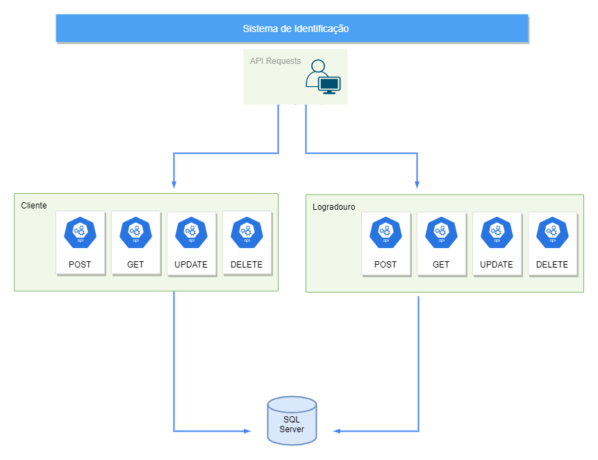

<h1> Sistema de Identificação </h1>
CRUD criado para cadastro de clientes com logotipo, onde são enviadas requisições HTTP para gerenciamento.

No sistema há 2 API'S com endpoints divididos em: <i> Cliente </i> e <i> Logradouro</i>. 

<h3> Cliente </h3>
<ul>
  <li>Get</li> Retorna o cadastro de determinado cliente.
  <li>Post</li> Cadastra um cliente. 
  <li>Update</li> Atualiza o cadastro de um cliente.
  <li>Delete</li> Deleta um cliente.
</ul>

<h3> Logradouro </h3>
<ul>
  <li>Get</li> Retorna determinado logradouro de determinado cliente.
   <li>Get All</li> Retorna todos os logradouros de determinado cliente.
  <li>Post</li> Cadastra um novo logradouro para um cliente.
  <li>Update</li> Atualiza um logradouro de um cliente.
  <li>Delete</li> Deleta um logradouro de um cliente. 
</ul>
 
Para verificar a documentação da utilização dessas API'S, complete o tópico de <a href="#instalacao"> 🔧 Instalação </a>. O Swagger informará os parâmetros e rotas necessárias.
</img>

<h1> 🚀 Começando </h1>
Essas instruções permitirão que você obtenha uma cópia do projeto na sua máquina local para fins de desenvolvimento e teste.

<h1> 📋 Pré-requisitos </h1>
O que é necessário para a instalação?
 
<pre> <code> 
Visual Studio
SQL Server (ou instância SQL em nuvem)
</code> </pre>

<h1 id="instalacao"> 🔧 Instalação </h1>
Uma série de exemplos passo-a-passo que informam o que você deve executar para ter um ambiente de desenvolvimento em execução.

<pre> <code>  
1. Recrie a base de dados SQL em seu desktop. Para o funcionamento do projeto, são necessárias duas tabelas: 
<i> Cliente </i> e <i> Logradouro </i>. Aqui está o script para criação: <a href="https://github.com/rianers/ThomasGreg/blob/master/ScriptDB.txt"> Script </a>
 
2. Clone o projeto e encontre o arquivo 'appsettings.json'. 
 
3. Abra o 'appsettings.json' e insira a string de conexão da base de dados que você criou. Insira no local onde está escrito: 
'INSIRA A STRING DE CONEXÃO AQUI'
 
4. Compile a solução. O Swagger informará as API'S do projeto e como utilizá-las.
</pre> </code> 

<h1> 🛠️ Construído com </h1>
Tecnologia: .NET Core 3.1

Swagger - Ferramenta para criação da documentação da API.
 
Dapper - Micro ORM utilizado para criação de relação entre o modelo físico e o modelo lógico da aplicação.

 by Riane 😊 
